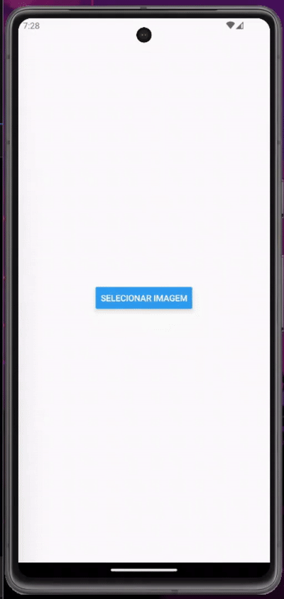

# Image Color Converter App
A mobile application built with React Native, Expo, and TypeScript, allowing users to convert images to black-and-white. Users can select an image, send it to a server, and receive a processed black-and-white version. The processed image can then be saved directly to the device's gallery.

The server component of this application is built with Django and is hosted in a [separate repository](https://github.com/kelvinleandro/imgserver), handling the image processing and communication with the mobile app. 

## Preview

